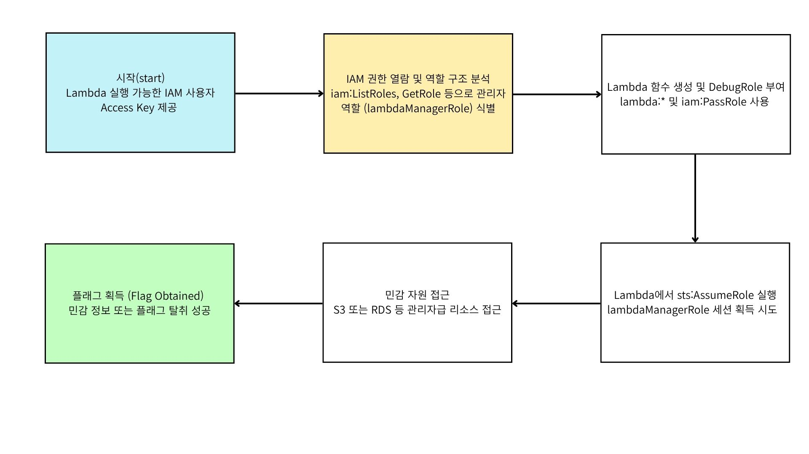

# **시나리오: lambda_privesc_bypass**

**크기** : 중간

**난이도** : 중 

**명령어** : $ ./cloudgoat.py create lambda_privesc_bypass 

### 시나리오 리소스

- 1 IAM 사용자 (attacker-user)
- 1 Lambda 실행 역할 (DebugRole)
- 1 관리자급 IAM 역할 (lambdaManagerRole)
- 1 Lambda 함수
- 1 S3 버킷 또는 RDS 인스턴스 (플래그 저장)
- CloudWatch Logs (lambda 로그 확인용)

## 시나리오 시작

1. attacker-user 계정의 AWS Access Key 및 Secret Key 제공
2. 초기 권한: lambda:*, iam:PassRole (단, PassRole 리소스 제한 없음)
3. lambdaManagerRole, DebugRole 부여
4. s3명 : flag-bucket-lambda-privesc 

## 시나리오 목표

Lambda 함수 내부에서 sts:AssumeRole을 실행하여

직접적으로 접근할 수 없는 관리자급 역할(lambdaManagerRole)을 우회적으로 획득하고,

해당 역할로 민감 자원(S3 또는 RDS)에 접근하여 **플래그를 탈취**하는 것이 목표입니다.

## 요약

이 시나리오는 공격자가 제한된 권한 (lambda:*, iam:PassRole)만 가지고 있을 때, Lambda 실행 역할(DebugRole)을 활용해 관리자급 역할(lambdaManagerRole)을 우회적으로 획득할 수 있음을 보여줍니다.

공격자는 Lambda 생성 시 DebugRole을 부여하고,

그 내부에 sts.assume_role 호출 코드를 삽입하여

Trust Policy 조건을 우회하고 높은 권한 세션을 획득합니다.

최종적으로 해당 세션을 사용해 S3 또는 RDS 등의 민감 자원에 접근해

플래그를 얻는 것으로 공격이 완료됩니다.

### 공격 루트
예시

## 세부 공격 흐름

1. attacker-user로 로그인하여 iam:ListRoles, iam:GetRolePolicy 등을 통해 역할 목록을 확인합니다.
2. Lambda 서비스에서만 사용할 수 있는 Debugrole이 존재함을 확인합니다.
3. Lambda 함수를 생성하고, 실행 역할로 DebugRole을 설정합니다 (iam:passrole 활용).
4. Lambda 내부 코드에서 boto3.sts.assume_role()을 사용하여 lambdaManagerRole을 Assume합니다.
5. AssumeRole 호출이 성공하면, 반환된 세션 자격 증명을 사용해 S3 또는 RDS 접근을 시도합니다.
6. 자원에 접근하여 플래그를 확인하고, 최종적으로 플래그를 획득합니다

자세한 풀이 방법은 [이곳](./cheat_sheet.md)에서 확인가능하다.  